# Continuous Improvement Control Plane

Date: 2026-08-14

Status: architecture design; no runtime behavior implemented by this spec

Owner: repository maintainer

Revision: v2.1 — liveness-first implementation order after independent review

Related: [Scout Optimization Spec](../../SCOUT_OPTIMIZATION_SPEC.md),
[Truth Harness](truth-harness.md),
[Learning Loop Architecture Roadmap](learning-loop-architecture-roadmap.md),
[Hypothesis Queue](hypothesis-queue.md),
[Canonical Portfolio Alpha](canonical-portfolio-alpha.md)

## 1. Purpose

Define a continuous research and improvement control plane for
`gpt_crypto_bot` that:

1. turns mature bot evidence into a small number of falsifiable hypotheses;
2. admits only hypotheses that can be evaluated with the available statistical
   power;
3. sends accepted hypotheses to deterministic, independent validation;
4. records every attempt, including invalid, refuted, underpowered, and failed
   attempts;
5. decides the next research action without allowing an LLM to modify the live
   metric, data snapshot, validator, or production configuration;
6. advances a behavior change only through layer-specific replay, forward
   shadow evidence, and operator approval.

Continuous improvement means continuous evidence accumulation and explicit
decision making. It does not mean continuous production mutation. `NO_CHANGE`,
`WAITING_FOR_DATA`, `UNDERPOWERED`, and `REFUTED` are normal terminal outcomes
for a research cycle.

## 2. Honest starting point

The repository already has substantial parts of a learning loop:

- daily critic and signal-quality evidence;
- `files/research_event_cohort_store.py` for incremental cohorts;
- `files/policy_provenance.py` for policy and label timing provenance;
- `files/replay_backtest.py` for deterministic replay;
- `files/portfolio_alpha.py` for a unified ten-slot portfolio result;
- `files/truth_harness.py` for fail-closed evidence checks;
- a diagnostic hypothesis queue;
- V2 shadow, model, replay, and forward-gate research components.

The primary demonstrated risk is not only that a bad change can be promoted.
The loop can also accumulate architecture, reports, and research modules without
ever producing a decision-grade terminal experiment. The control plane must
therefore optimize two properties together:

1. **truthfulness:** no unsupported progress claim or unsafe promotion;
2. **liveness:** every admitted experiment reaches a visible terminal state or
   a named operational failure within a bounded time.

### 2.1 Truth Harness checkpoint on 2026-08-14

The current full Harness is `FAIL` for model/RL evidence:

- RL evidence is older than its freshness budget;
- the newest model achievement artifact lacks decision/label timing and
  chronological evaluation provenance;
- there are no mature provenance-verified model rows.

These findings block current model/RL achievement and promotion claims. They do
not block documentation, read-only diagnosis, measurement repair, or unrelated
WATCH-only research. Section 13 defines scoped blocking and remediation
ownership so a broad Harness result cannot become a permanent, ownerless freeze.

## 3. Governing principles

1. **Power before hypothesis generation.** The system estimates whether the
   available population can answer the intended question before spending LLM or
   replay compute.
2. **One primary hypothesis per validation cycle.** Diagnostic alternatives may
   be recorded, but only one pre-registered primary change consumes the current
   testing budget.
3. **The orchestrator owns evidence snapshots.** An agent cannot choose, freeze,
   retry, or rewrite the data on which its idea will be judged.
4. **The LLM proposes; deterministic services dispose.** Numeric metrics,
   confidence intervals, power, and promotion eligibility are computed outside
   the LLM.
5. **Action-layer-specific objectives.** WATCH/alert improvements are not judged
   by simulated PnL. BUY/SELL/portfolio changes must also pass economic and risk
   non-inferiority gates.
6. **No hidden retry.** Every Harness, validation, and judge attempt is an
   immutable ledger entry. A later pass never erases an earlier fail.
7. **Forward evidence is consumed once.** A revealed forward cohort may become
   historical evidence, but the same hypothesis version cannot be retuned and
   re-judged on it.
8. **Scoped fail-closed.** A finding blocks only claims and actions dependent on
   the failed invariant. Every blocker has an owner, repair action, and SLO.
9. **No LLM production write path.** Research memory and executable release
   state are different stores with different credentials.
10. **Complexity must earn its place.** Multi-agent generation, semantic RAG,
    LLM judges, and adaptive research allocation are added only after a simpler
    loop demonstrates measurable yield.
11. **Prove the pipe before completing the platform.** A deliberately small
    walking skeleton must reach a verified terminal experiment before Phase 0
    builds comprehensive metric, label, and capability registries.

## 4. Target architecture

```mermaid
flowchart LR
    RAW["Bot events, candles, labels"] --> PACK["Mature Evidence Pack"]
    ORCH["Durable Orchestrator"] --> SNAP["Immutable Snapshot Manifest"]
    PACK --> SNAP
    SNAP --> POWER["Power / Feasibility Gate"]
    POWER -->|feasible| AGENT["Research Agent"]
    POWER -->|not feasible| WAIT["WAITING_FOR_DATA or METRIC_REDESIGN"]
    AGENT --> CONTRACT["Typed Hypothesis Contract"]
    CONTRACT --> PRECHECK["Deterministic Contract Precheck"]
    PRECHECK --> VALIDATOR["Independent Validator / Replay"]
    VALIDATOR --> RESULT["Validation Result Bundle"]
    RESULT --> VERIFY["Independent Result Verification"]
    VERIFY --> GOVERNOR["Deterministic Decision Policy"]
    GOVERNOR -->|refuted or invalid| MEMORY["Experiment Ledger"]
    GOVERNOR -->|supported| SHADOW["Forward Shadow"]
    SHADOW --> CANARY["Operator Alert Canary"]
    CANARY --> APPROVAL["Operator Approval"]
    APPROVAL --> RELEASE["Flagged Candidate Policy"]
    RELEASE --> MONITOR["Candidate-specific Monitor"]
    MONITOR -->|regression| BASELINE["Rollback to Frozen Baseline"]
    MEMORY --- ORCH
    SNAP --- MEMORY
    WAIT --- MEMORY
```



The durable orchestrator, not the LLM, owns state transitions, retries,
snapshots, Harness execution, budgets, and timeout handling.

## 5. Action-layer objective contract

The system does not use one universal promotion metric. Each hypothesis declares
one action layer and inherits that layer's mandatory objective and guardrails.

### 5.1 DISCOVERY / WATCH / Telegram alert layer

Mission:

- detect developing same-day watchlist movers early enough to be useful;
- raise coverage without flooding the operator with favorable-looking false
  positives.

Primary objective family:

- watchlist-top early capture on the canonical later label;
- `Coverage@MoveEvent` as a higher-volume steering metric;
- detection lead time or captured fraction at first alert.

Mandatory guardrails:

- `Precision@Alert` on the same `MoveEvent` definition;
- false-positive rate;
- unique alerts per active day;
- duplicate-alert count;
- message-delivery failure rate;
- active-universe and candle coverage.

Portfolio alpha is not a hard gate for a WATCH-only change that cannot open,
close, size, or replace a position.

### 5.2 BUY admission layer

Primary objective:

- earlier canonical watchlist-top capture under the real candidate population.

Mandatory guardrails:

- trade precision and false-positive admissions;
- unified ten-slot capacity;
- paired canonical portfolio-alpha non-inferiority after fees/slippage;
- drawdown, turnover, and concentration non-inferiority.

### 5.3 SELL / exit / re-entry layer

Primary objective:

- improve realized trend monetization and reduce avoidable giveback.

Mandatory guardrails:

- paired canonical portfolio result after costs;
- false-early-exit and worse-case rate;
- drawdown and churn;
- re-entry frequency and incremental costs;
- ten-slot portfolio interaction.

### 5.4 Portfolio selection and replacement layer

Primary objective:

- improve marginal value of the occupied ten-slot account.

Mandatory guardrails:

- canonical portfolio alpha versus a named benchmark;
- drawdown, turnover, concentration, and replacement regret;
- candidate-versus-incumbent causal comparison.

### 5.5 Objective immutability

The agent may reference a registered metric version but cannot modify its:

- numerator or denominator;
- eligible universe;
- label horizon or cutoff;
- missing/downtime treatment;
- costs, benchmark, or portfolio capacity;
- minimum practical effect or non-inferiority margin.

A metric change is a separate human-approved spec with an overlap report that
recomputes old and new definitions on the same population.

## 6. Higher-volume weekly steering event

The canonical watchlist-top mission has too few independent events for reliable
week-to-week decisions. A higher-volume `MoveEvent` may be used as a steering
metric, not as a replacement for the mission objective.

### 6.1 Versioned `MoveEvent` contract

The initial research target is a `+5%` move, but the threshold remains
provisional until its relationship with canonical top-mover capture is measured.
Every event version records:

- immutable watchlist/universe snapshot;
- `event_day_timezone`;
- canonical objective-day open/reference price;
- fixed label cutoff, currently aligned with the objective cutoff;
- movement threshold, initially `+5%`;
- midpoint threshold, initially `+2.5%`;
- first threshold-crossing time;
- label availability time;
- one unique `event_id = symbol + objective_day + event_version`.

### 6.2 Paired steering metrics

For the same event version and cutoff:

- `Coverage@Move5`: among confirmed `MoveEvent(+5%)` symbol-days, the share with
  a first eligible alert before the first `+2.5%` crossing;
- `Precision@Alert5`: among unique eligible symbol-day alerts emitted before the
  first `+2.5%` crossing or event cutoff, the share whose symbol-day later
  confirms the same `MoveEvent(+5%)`.

Repeated alerts for the same symbol-day do not enlarge the denominator. A
separate duplicate/noise counter records them.

### 6.3 Use restrictions

- `Move5` can prioritize research and measure weekly evidence accumulation.
- It cannot approve a BUY/SELL change without that layer's canonical guardrails.
- The report must publish the relationship between `Move5` and canonical
  watchlist-top outcomes.
- If the surrogate relationship is weak or unstable, `Move5` remains diagnostic
  and cannot produce a positive overall progress verdict.

## 7. Power and feasibility gate

The power gate runs before an LLM sees the evidence pack.

### 7.1 Required output

For every proposed objective/population pair, deterministic code reports:

- raw event count;
- number of complete objective days;
- effective sample size after day/block clustering;
- base rate and variance;
- source coverage and downtime;
- minimum practical effect (`SESOI`);
- minimum detectable effect (`MDE`) for the planned design;
- expected confidence interval width;
- estimated probability of an inconclusive result under realistic effect sizes;
- earliest expected maturity date for a decision-grade forward result.

Power calculations use day/block bootstrap or another dependence-aware method.
Symbols inside the same market day are not assumed independent.

### 7.2 Admission policy

A normal behavior hypothesis is not sent to expensive validation when the
estimated probability of `INCONCLUSIVE` exceeds the versioned power budget. The
initial design budget is `80%`; changing it requires an operator decision and a
recorded reason.

Exceptions:

- a data-collection hypothesis;
- a cheap negative-control or validator smoke test;
- an operational safety change whose evidence is deterministic rather than
  sampled;
- an explicitly approved exploratory run that cannot produce promotion.

### 7.3 Power-expansion track

`WAITING_FOR_DATA` is not a strategy by itself. When a primary population is
infeasible, the orchestrator registers exactly one pre-declared power-expansion
action before another hypothesis version can consume validation budget:

1. extend the calendar window while preserving policy-epoch comparability;
2. pool exchangeable symbols with a day-clustered hierarchical/partial-pooling
   model rather than pretending symbol-days are independent;
3. replace a sparse binary response with a causal continuous response such as
   remaining return or captured fraction, while retaining the canonical binary
   objective as a guardrail;
4. use a lower, higher-volume event threshold only after registering and
   measuring its transfer relationship to the canonical objective;
5. widen the real candidate population or prioritize a mechanism with a larger
   eligible population;
6. repair missing observation/outcome logging when data loss, not market rarity,
   is the limiting factor; or
7. terminate as `ACCEPTED_UNKNOWN` when none of the above preserves the intended
   causal question.

The choice is made from the pre-result power report, not after inspecting a
favorable slice. A changed outcome, threshold, population, or pooling model
creates a new metric/hypothesis version and cannot retroactively rescue the old
result.

### 7.4 Weekly reporting rule

MDE is a planning statistic, not a verdict threshold. The report publishes:

- point estimate;
- confidence interval or confidence sequence;
- `SESOI`;
- MDE and effective sample size;
- status: `IMPROVING`, `DEGRADING`, `PRACTICALLY_EQUIVALENT`, or
  `INSUFFICIENT_EVIDENCE`.

Direction is asserted only by the registered interval/sequential rule. It is
never inferred merely because `abs(delta) > MDE`.

## 8. Evidence pack and snapshot ownership

### 8.1 Orchestrator-owned snapshot

The research agent has no `freeze_snapshot` tool. Before agent invocation, the
orchestrator creates an immutable manifest containing:

- attempt ID and experiment ID;
- policy epoch and effective config hash;
- code commit and validator build identity;
- source file/object hashes, row counts, and high-water marks;
- feature cutoff, label cutoff, and label definition;
- universe snapshot hash;
- completeness, freshness, and exclusions;
- metric registry versions;
- previous related and rejected experiments.

Byte offsets are incremental-read cursors, not content addresses. Snapshot
identity requires cryptographic hashes of the consumed content or immutable
objects.

### 8.2 Policy epoch and evidence transport

A `policy_epoch` is the semantic identity of production decision behavior, not
the identity of every source commit. It changes when a modification can alter:

- candidate eligibility, score, routing, gate order, or action selection;
- BUY/SELL/re-entry, sizing, position, replacement, or portfolio behavior;
- decision-time feature or label semantics used by a live model;
- active-universe eligibility, capacity, fee/slippage, or benchmark contracts;
- an effective runtime override that changes any item above.

Documentation, tests, logging-only fields, performance refactors, and repairs
with proven decision-trace equivalence do not create a new epoch. Their code and
config hashes still remain in the manifest.

An epoch transition does not delete prior evidence. Each prior result becomes
one of `directly_comparable`, `transportable_with_bridge`, or `historical_only`.
Pooling across epochs requires a registered overlap/bridge analysis on the same
candidate population; otherwise the evidence remains a diagnostic historical
prior. Regime is recorded separately from policy epoch. A market-regime change
does not rewrite the policy identity.

### 8.3 Prepared evidence pack

Minimal-budget weekly operation uses a deterministic prepared pack rather than
an open-ended agent query loop. It contains:

- objective and guardrail scorecard;
- decomposition by observation, alert, admission, portfolio, exit, and re-entry;
- highest-opportunity failure cohorts;
- current Harness findings and their scopes;
- power table for eligible research populations;
- experiment history and negative-result matches;
- no more raw rows than needed to support cited cases.

## 9. LLM research agent

### 9.1 Initial topology

Phase 2 uses one provider-neutral `ResearchAgent`, not a six-agent swarm. The
model implementation may be GPT-5.6, Claude, or another evaluated provider.
Provider-specific multi-agent or beta API features are optional adapters, never
architecture dependencies.

The model receives:

- one immutable evidence pack;
- a bounded capability registry;
- negative/rejected experiment summaries;
- the typed output schema;
- no production-write tool;
- no snapshot, Harness-execution, or metric-definition tool.

It emits at most three ranked ideas, but only the highest-ranked power-feasible
idea may become the primary hypothesis for the cycle.

### 9.2 Model provenance

Every generation records:

- provider and model identifier;
- model snapshot/version when available;
- prompt, skill, and tool-schema hashes;
- generation parameters;
- input snapshot ID;
- structured output and validation errors;
- token, latency, and monetary budget use.

Changing model/provider requires replaying the agent-evaluation corpus before
the new adapter can create primary hypotheses.

### 9.3 Cost and resource envelope

Every cycle receives a versioned `CycleBudget` covering LLM calls/tokens/cost,
validator CPU or wall time, storage, and operator-review minutes. The initial
minimal policy permits one primary generation plus at most one schema-repair
generation and one primary validator run. Negative controls that are part of the
registered protocol share the same validation envelope.

When the envelope is exhausted, work is removed in this order:

1. extra LLM drafts, semantic retrieval, and narrative explanation;
2. unpowered diagnostic regime slices and optional robustness reports;
3. exploratory secondary hypotheses.

The snapshot, provenance checks, primary validator, result verification,
mandatory guardrails, and immutable ledger are never weakened to fit the budget.
If those cannot complete, the attempt ends as `BUDGET_EXHAUSTED`; it does not
become a cheaper positive result.

### 9.4 Frozen-world meta-evaluation

Before agent proposals consume real validation budget, freeze the world at an
historical date `T`: data available at `T`, MD corpus, prompts, skills, metric
and capability registries, tool schemas, policy epoch, and model/provider
snapshot. Run the full propose-only loop without post-`T` evidence, then compare
its proposals with outcomes and decisions that became available after `T`.

The agent is compared with a deterministic opportunity-priority baseline and
the operator's recorded historical proposals on proposal validity, supported
hypothesis precision, avoided harmful validation, incremental objective value,
cost, and latency. Provider replacement repeats this evaluation. A provider
that adds no measured value remains a summarizer and cannot select the primary
hypothesis.

### 9.5 Deferred multi-agent use

Author/Adversary/Referee separation is considered only after:

- at least 30 decision-grade terminal experiments exist across at least three
  mechanism families;
- a calibrated evaluation shows that the extra role materially improves
  supported-hypothesis precision or reduces harmful false promotion;
- the benefit exceeds additional cost, latency, and operational failure rate.

Until then, deterministic prechecks and operator review provide the separation.
At the expected program cadence in Section 16.4, this evidence threshold may
take years. Multi-agent decomposition is therefore an unscheduled option, not a
committed rollout milestone.

## 10. Typed hypothesis contract

An admitted hypothesis is immutable and includes:

```text
hypothesis_id
version
parent_hypothesis_id
attempt_id
action_layer
objective_metric_version
guardrail_versions
incident_or_cohort_refs
causal_mechanism
target_capability
proposed_change
affected_population
expected_effect_and_horizon
competing_explanation
falsifier
minimum_practical_effect
registered_validator_id
validation_protocol
rollback_flag
evidence_snapshot_id
```

### 10.1 Capability validation

The capability registry combines:

- explicit schemas for supported config/policy changes;
- runtime-effective config, including environment/override resolution;
- source-derived references showing where a capability is consumed;
- cross-field constraints and safe ranges;
- validator bindings.

AST extraction may assist inventory, but it is not sufficient proof that a
capability is reachable or semantically safe.

### 10.2 Two hypothesis lanes

1. **Existing-capability lane:** parameter, routing, or policy changes expressible
   by the registered strategy schema.
2. **Engineering lane:** new indicators, features, models, or algorithms that
   require code. These create a spec/implementation proposal and cannot enter
   the validation queue until focused tests and a registered validator exist.

`No validator` therefore means `NEEDS_VALIDATOR`, not loss of the idea. It cannot
enter execution or promotion.

### 10.3 Negative-result matching

Structured matching uses mechanism, target, population, policy epoch, metric
version, and data regime. Semantic similarity is advisory and cannot hard-reject
an experiment by itself. Reopening a related refuted idea requires an explicit
novelty claim and new evidence.

A regime change is a legitimate reopening basis only when the regime definition
was fixed without using the candidate result and both the original and proposed
regime populations are identifiable. The contract records
`reopen_basis=regime_shift`, the old/new regime definitions, support, and the
mechanism explaining why the effect should change. Merely naming the latest
market an "altseason" or "bear market" is not new evidence.

### 10.4 Bootstrap migration of research memory

Before the first real or LLM-authored cycle, migrate the existing casebook,
rejected hypotheses, decision records, roadmap verdicts, and the 47 legacy
backtests without durable verdicts into the negative-results inventory. Each
item receives one migration state:

- `CONFIRMED_NEGATIVE` — period, population, metric, and verdict are recoverable;
- `LEGACY_UNVERIFIED` — an attempt exists but cannot support a decision;
- `DUPLICATE` — linked to a canonical migrated item; or
- `MIGRATION_ERROR` — unreadable source with a named repair/debt record.

Migration never invents missing denominators or upgrades legacy evidence. An
unverified item creates a similarity warning, not an automatic rejection. The
first production-relevant cycle is blocked until the inventory is complete,
although the Phase -1 synthetic walking skeleton is not.

## 11. Attempt and experiment ledger

Every invocation is append-only and idempotent by attempt ID.

Required events include:

- snapshot created or failed;
- power gate result;
- LLM generation attempt;
- contract precheck;
- Harness run;
- validator submission, start, timeout, and completion;
- result verification;
- shadow registration and maturity;
- operator decision;
- release, rollback, and attribution.

Each event stores input/output hashes and the prior state. A retry receives a new
attempt ID and `retry_of`, plus a reason. Previous failures remain queryable.

Research memory is not executable configuration. The agent may propose an event,
but only the orchestrator writes the ledger. Production reads a separate signed
release store written only after operator approval.

## 12. Independent validation

### 12.1 Trust boundary

The validator is deterministic and has:

- read-only access to the orchestrator snapshot;
- no LLM dependency;
- an allowlisted experiment schema;
- a pinned code/build identity;
- bounded compute and network access;
- reproducible commands and seeds where stochastic training is required;
- no permission to modify production state.

The first implementation may wrap existing replay code, but independence is not
claimed until the validator can reproduce a result from only its signed manifest
and immutable inputs.

### 12.2 Scarce-data validation protocol

- use the maximum available historical period and the bot's actual candidate
  population;
- preserve complete decision-day groups;
- use rolling-origin or walk-forward evaluation;
- apply purge/embargo only where feature/label overlap requires it;
- run one registered primary hypothesis per cycle;
- treat regime slices as diagnostic unless independently powered;
- report all attempted parameters, not only the winner;
- reserve newly mature forward data as the one-use final evidence for the current
  hypothesis version;
- after reveal, require a new version and new future cohort for retuning.

### 12.3 Layer-specific result bundle

Every result contains:

- actual period, population, numerator/denominator, and coverage;
- baseline and candidate on the same frozen inputs;
- effect, uncertainty interval, base rate, lift, and power status;
- primary objective and all mandatory action-layer guardrails;
- robustness and negative controls that were pre-registered;
- transaction costs and portfolio simulation only for position-affecting layers;
- verdict: `SUPPORTED`, `REFUTED`, `UNDERPOWERED`, or `INVALID`;
- artifact, snapshot, policy, metric, code, and validator hashes.

`estimated_objective_delta` from a proxy cannot substitute for direct canonical
objective evidence.

### 12.4 Independent result verification

The governor consumes only a `VERIFIED_RESULT`, never the validator's summary
directly. A deterministic verifier independently recomputes the primary metric,
mandatory guardrails, denominator, interval, and manifest hashes from the result
artifacts. A mismatch produces `INVALID_RESULT`, records both payloads, and
cannot be overridden by the LLM, operator canary, or promotion governor.

## 13. Scoped Truth Harness and remediation ledger

### 13.1 Finding contract

Every blocking finding must state:

- invariant ID and finding ID;
- affected claim/action scope;
- blocked actions;
- explicitly allowed work;
- repository owner and triage category;
- repair task;
- verification command or evidence;
- acknowledgement SLO, review date, and escalation state.

A finding without owner or remediation is itself a control-plane defect.
Finding states are `OPEN`, `ACKNOWLEDGED`, `REPAIRING`, `ACCEPTED_DEBT`,
`VERIFIED`, and `SUPERSEDED`. `ACCEPTED_DEBT` is an honest terminal triage
outcome, not a waiver: the affected claim/action remains blocked until the
invariant is repaired or a separately approved, expiring waiver exists.

### 13.2 Initial scope policy

| Finding class | Blocks | Does not block | Triage category | Acknowledge SLO |
|---|---|---|---|---|
| Stale RL/model report | current RL/model achievement and promotion claims | measurement repair, docs, unrelated rule/WATCH research | learning worker | next weekly triage |
| Missing feature/label/evaluation provenance | training artifact promotion | provenance implementation and read-only diagnosis | model pipeline | next weekly triage |
| Zero mature provenance-verified rows | model/ranker promotion | cohort collection, power reporting, rule-based replay | labels/cohort | next weekly triage |
| Missing canonical portfolio evidence | BUY/SELL/portfolio promotion | WATCH-only shadow and measurement | portfolio evaluator | next weekly triage |
| Missing/partial active-universe data | claims using affected population | repair and unaffected explicitly scoped populations | market data | next weekly triage |

All rows have the same accountable owner: `repository maintainer`. Categories
route the queue; they do not pretend that five independently staffed teams or
on-call rotations exist. Repair dates are estimates recorded at triage, not
fictional service guarantees. Unscheduled repair is explicitly
`ACCEPTED_DEBT(review_at=...)`.

### 13.3 Harness execution ownership

The LLM cannot call `harness.verify` repeatedly. The orchestrator runs the
required profile once per state transition. Additional runs require a new
attempt event with changed input hash or an explicit operator-approved reason.

## 14. Promotion for an alert-oriented product

### 14.1 Silent shadow

The candidate evaluates production observations but sends no Telegram message
and changes no position. It records what it would have emitted under the frozen
candidate policy.

### 14.2 Operator alert canary

Candidate messages go to a separate operator-only channel or are clearly tagged
in an audit digest. They never duplicate the production message in the normal
operator channel.

For the current single-operator product, a successful operator canary may be the
final alert-quality gate. A user-facing traffic canary is omitted unless the bot
later serves multiple independent users or alert UX itself must be evaluated.

The operator rates a masked, randomized baseline/candidate digest against a
pre-registered rubric before policy identity and aggregate results are revealed.
The ledger stores `rule_verdict`, `operator_decision`, rubric scores, and any
`decision_deviation` separately. A deviation requires a contemporaneous reason
and cannot override a deterministic data-, message-safety-, economic-, or
Harness block. This makes post-hoc rationalization visible even though a second
human reviewer is unavailable.

### 14.3 Optional user-visible cohort

If later required, assignment uses the deterministic key
`hash(symbol, objective_day, candidate_version)`, with:

- a predeclared fraction;
- exactly one active alert policy per symbol-day/user;
- no duplicate baseline/candidate notifications;
- a hard daily message budget;
- automatic reversion to baseline at the end of the canary window.

### 14.4 Position-affecting canary

BUY/SELL/portfolio changes remain shadow-only until their replay and forward
economic gates pass. Any later live canary must additionally specify capital or
slot exposure, maximum loss, duration, and automatic rollback. This spec does
not authorize such a canary.

## 15. Candidate-specific monitoring and rollback

The monitor never kills the stable baseline merely because a candidate fails.
Its action is `candidate_flag = OFF`, followed by restoration of the frozen
baseline.

Every promotion manifest pre-registers:

### 15.1 Data-health triggers

- candle/feature age limit appropriate to the timeframe;
- maximum consecutive scan failures;
- minimum active-universe coverage;
- allowed malformed or unresolved event count;
- policy/snapshot provenance mismatch.

Any hard data-integrity violation immediately disables the candidate.

### 15.2 Message-safety triggers

- zero tolerated duplicate production alerts for the same dedup key;
- hard maximum unique alerts per day;
- maximum candidate increase versus baseline message rate;
- Telegram delivery failure threshold.

### 15.3 Quality triggers

- minimum mature sample and minimum complete days;
- precision and false-positive non-inferiority margins;
- sequential/confidence rule and window;
- maximum unresolved or missing-label share.

Quality rollback occurs only after the pre-registered maturity rule. Data and
message-safety rollback may be immediate.

## 16. Liveness and operational SLOs

No promotion is not automatically a failure. No completed experiment or named
terminal outcome is a liveness failure.

### 16.1 Durable experiment states

```text
OBSERVED
  -> SNAPSHOT_READY | SNAPSHOT_INVALID
  -> POWER_FEASIBLE | WAITING_FOR_DATA | POWER_EXPANSION | METRIC_REDESIGN
  -> PROPOSED
  -> CONTRACT_VALID | NEEDS_VALIDATOR | CONTRACT_REJECTED
  -> VALIDATION_RUNNING
  -> SUPPORTED | REFUTED | UNDERPOWERED | INVALID | BUDGET_EXHAUSTED
  -> SHADOW_RUNNING
  -> FORWARD_SUPPORTED | FORWARD_REJECTED | FORWARD_WAITING
  -> OPERATOR_APPROVED | OPERATOR_REJECTED
  -> ACTIVE | ROLLED_BACK
```

Every run must reach a terminal or waiting state with an explicit next wake-up
condition.

### 16.2 Required controls

- idempotent state transition keys;
- per-stage leases and timeout recovery;
- bounded retries with visible `retry_of` links;
- dead-letter state for non-transient failures;
- queue-age and last-transition telemetry;
- reconciliation after process restart;
- one owner-visible weekly control-plane report.

### 16.3 Stalled-loop alarms

- no evidence pack at the configured weekly slot;
- no terminal validation result for two consecutive cycles;
- all generated hypotheses contract-invalid for two cycles;
- the same operational error in three consecutive attempts;
- only `UNDERPOWERED` outcomes for four cycles without metric/window redesign;
- a blocking Harness finding past its remediation SLO.

The alarm reports the failed stage and owner. It does not create a more
optimistic trading conclusion.

### 16.4 Program cadence and capacity

The operating cadence is deliberately slower than the report cadence:

- deterministic evidence/power pack: weekly;
- new primary historical validation admission: at most one per week;
- normal forward-label maturity for one hypothesis version: expected 2–4 weeks;
- planning capacity: at most 12 decision-grade forward hypothesis versions per
  year until measured throughput demonstrates otherwise;
- no more than three simultaneous `FORWARD_WAITING` versions, each with a fixed
  wake-up condition and separate testing budget.

The weekly report must not imply weekly self-improvement. At this capacity the
30-experiment multi-agent gate is at least a multi-year possibility, which is
why it is not scheduled. Throughput is raised first by eliminating operational
stalls and choosing powered populations, not by weakening maturity rules.

## 17. Tool and MCP surface

### 17.1 Agent-visible read tools

- `evidence.get_prepared_pack(attempt_id)`
- `evidence.get_capability(capability_id)`
- `evidence.find_related_experiments(query)`
- `experiments.get_status(experiment_id)`
- `validation.get_result(experiment_id)`

### 17.2 Orchestrator-only tools

- create/freeze snapshot;
- run Harness;
- register attempt and transition state;
- submit validation;
- register shadow/canary;
- request operator approval;
- write signed release or rollback state.

### 17.3 Prohibited agent tools

- metric-definition mutation;
- dataset or label mutation;
- direct shell or arbitrary validator code;
- production config/override writes;
- Harness retry;
- production restart or Telegram production send.

MCP is an interface, not a trust boundary by itself. Server-side authorization,
schemas, service identities, and audit logs enforce capability restrictions.

## 18. Weekly control-plane report

The weekly report is deterministic before LLM interpretation and contains:

1. **Evidence health**
   - complete days, active-universe coverage, freshness, label maturity;
   - Harness findings with scopes, owners, and SLOs.
2. **Direction toward the objective**
   - canonical mission metric on its valid horizon;
   - `Move5` steering coverage/precision;
   - effect, interval, SESOI, MDE, and effective sample size;
   - no arrow when the registered inference rule is inconclusive.
3. **Attribution of applied decisions**
   - one line per policy version;
   - forward maturity and causal/paired comparison status;
   - rollback state.
4. **Loop liveness**
   - attempts proposed, contract-valid, validated, terminal, waiting, and stale;
   - queue age and last successful transition;
   - no-change versus stalled-loop distinction.
5. **Power and cost control**
   - selected power-expansion action for every infeasible primary population;
   - cycle budget used/remaining and any `BUDGET_EXHAUSTED` terminal state.
6. **Next action**
   - at most three ideas;
   - one selected primary hypothesis, or an explicit measurement/data repair;
   - expected decision date and compute budget.

The LLM may summarize this pack but cannot alter its numeric verdicts.

## 19. Rollout plan

### Phase -1: walking skeleton before platform completeness

Build the smallest executable vertical slice first:

- one seeded, non-trading smoke hypothesis over a frozen synthetic fixture;
- one existing deterministic validator adapter;
- one minimal snapshot/contract/attempt record;
- validator result followed by independent result verification;
- one expected terminal state in the append-only ledger;
- all LLM, RAG, promotion, broad registries, and live integrations stubbed out.

Exit gate:

- one command takes a fresh attempt from `OBSERVED` to the expected verified
  terminal result in under ten minutes;
- the result is repeatable, restart-safe at the attempt boundary, and cannot
  reach a release store;
- a deliberately malformed result reaches `INVALID_RESULT` instead of the
  governor.

No Phase 0 registry or label work starts until this slice proves that the pipe
conducts an experiment. The skeleton is intentionally not decision-grade market
evidence and cannot support a trading conclusion.

### Phase 0: power and canonical labels

Build or verify:

- immutable `MoveEvent` labels;
- canonical top-mover later labels;
- effective-sample-size and power report;
- action-layer metric registry;
- current Harness remediation ledger.
- migrated negative-result inventory from existing reports, decisions,
  casebooks, and legacy backtests.

Exit gate:

- every reported objective has denominator, coverage, label timing, SESOI, MDE,
  and expected decision horizon;
- current model/RL blockers have owners and visible status;
- every known legacy research artifact has a migration state;
- no behavior change.

### Phase 1: repair existing loop liveness

Add or verify:

- durable experiment states around existing research components;
- attempt ledger;
- capability and validator bindings;
- queue-age, timeout, retry, and dead-letter reporting.

Exit gate:

- the Phase -1 smoke attempt is replayed through the durable state machine;
- an invented capability and missing validator are surfaced immediately;
- a process restart does not lose the attempt.

### Phase 2: single-agent propose-only

The evaluated provider adapter reads the prepared pack and emits typed
hypotheses. It has no write or validation-execution privileges.

Exit gate:

- at least ten proposals are schema-valid;
- duplicates and unsupported targets are measured;
- operator review finds the agent at least as precise as the deterministic
  priority baseline in the frozen-world evaluation before its proposals consume
  validation budget.

### Phase 3: one end-to-end decision-grade experiment

Run one power-feasible hypothesis through maximum-period replay and a one-use
forward cohort.

Exit gate:

- one terminal `SUPPORTED`, `REFUTED`, or honest `UNDERPOWERED` result;
- complete attempt/snapshot/result provenance;
- no manual alteration of experiment inputs after registration.

### Phase 4: alert shadow and operator canary

Advance only a supported WATCH/alert hypothesis. Production BUY/SELL behavior
remains unchanged.

Exit gate:

- operator canary completes its message and quality budgets;
- candidate rollback is demonstrated;
- no duplicate production alerts.

### Phase 5: optional advanced orchestration

Consider semantic RAG, a separate adversarial judge, multi-agent generation, or
adaptive research allocation only after the simpler loop demonstrates stable
yield and the new component passes its own eval. This phase is deliberately
unscheduled; the evidence threshold may take multiple years at current cadence.

## 20. Acceptance criteria

1. The architecture distinguishes WATCH-only and position-affecting objectives.
2. An LLM cannot freeze evidence, run Harness repeatedly, modify metrics, or
   write executable production decisions.
3. Every admitted experiment has a power report and one registered primary
   hypothesis.
4. Every attempt, retry, invalid result, and Harness run remains visible.
5. A full Harness failure produces scoped blocks, owners, and remediation SLOs.
6. The validator uses the bot's actual population and maximum available period.
7. Forward evidence is time-separated and consumed once per hypothesis version.
8. Alert canary and rollback have concrete message/product semantics.
9. The control plane detects a stalled pipeline independently of whether any
   hypothesis deserves promotion.
10. No production behavior is changed merely by implementing this architecture
    foundation.
11. Before Phase 0, the walking skeleton produces the expected verified terminal
    result and rejects a malformed result before the governor.
12. Before the first LLM-authored cycle, existing negative and inconclusive
    research has a visible migration state rather than an empty memory reset.
13. Within 30 days after Phase 1 completes, at least one real admitted hypothesis
    reaches a terminal validator result; otherwise the control-plane
    implementation is classified as a liveness failure even when its structural
    tests pass.
14. Before an agent selects primary hypotheses, frozen-world evaluation shows
    measured value over the deterministic baseline, with cost and latency.

## 21. Non-goals

- no LLM in the live scan or trading decision path;
- no autonomous metric/denominator change;
- no autonomous BUY/SELL/portfolio promotion;
- no requirement to run multiple model vendors simultaneously;
- no Thompson-sampling research allocator before enough attributed experiments;
- no large permanently sealed historical holdout at the current event rate;
- no favorable interpretation of stale, partial, proxy, or underpowered evidence.

## 22. Rollback

This document introduces no runtime behavior. Future implementation must be
feature-flagged by phase. Rolling back an implementation means disabling its
control-plane scheduler/flag and returning to the current manual hypothesis,
replay, and promotion workflow. Evidence and negative results remain append-only
and are never deleted during rollback.

## 23. Verification for this design change

- register this spec in `docs/FEATURE_SPEC_INDEX.md`;
- run `pyembed\python.exe files\test_continuous_improvement_control_plane_spec.py`;
- run `git diff --check`;
- run the staged Truth Harness profile;
- confirm that only the architecture spec, linked roadmap/provenance spec, index,
  and focused contract test are staged;
- do not commit runtime reports, datasets, logs, positions, or model artifacts.
